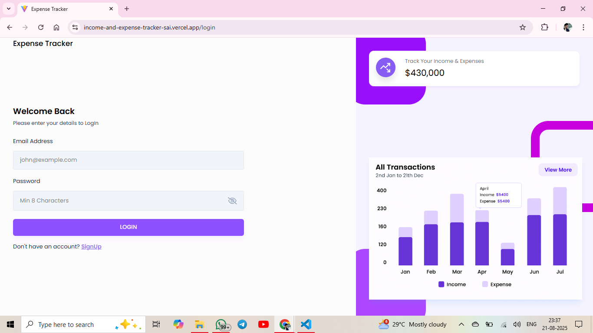
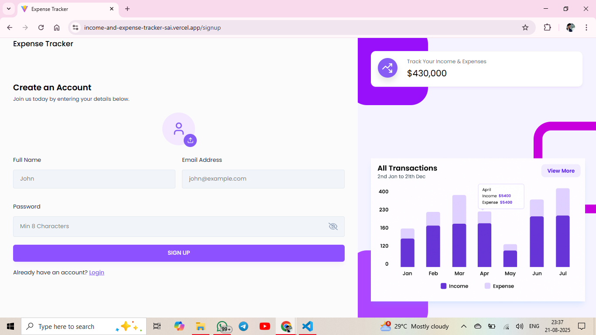
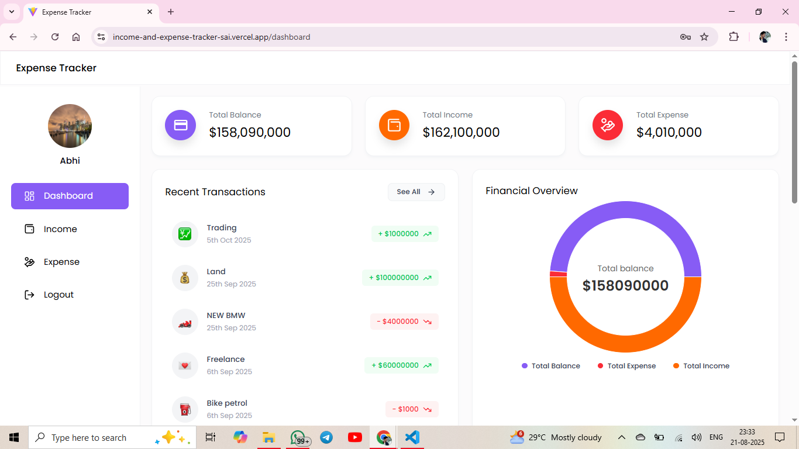
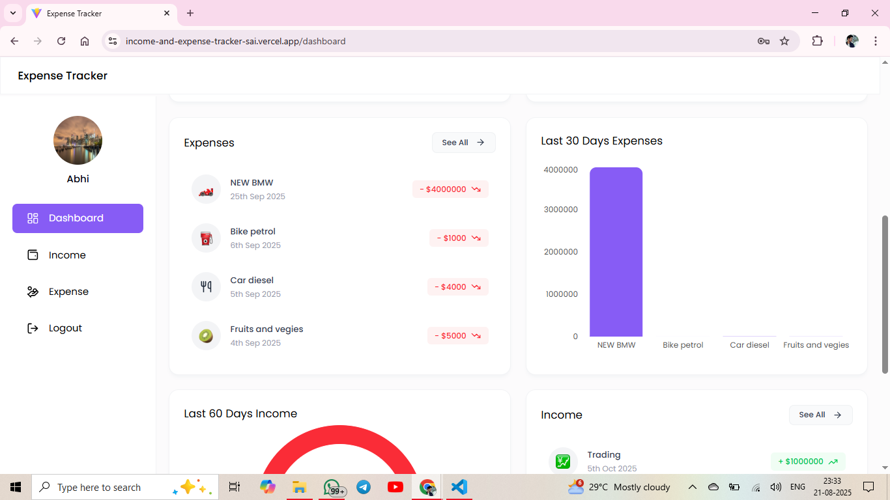
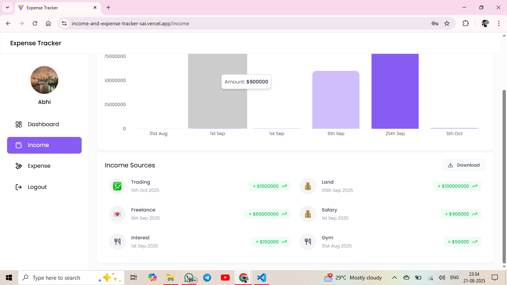
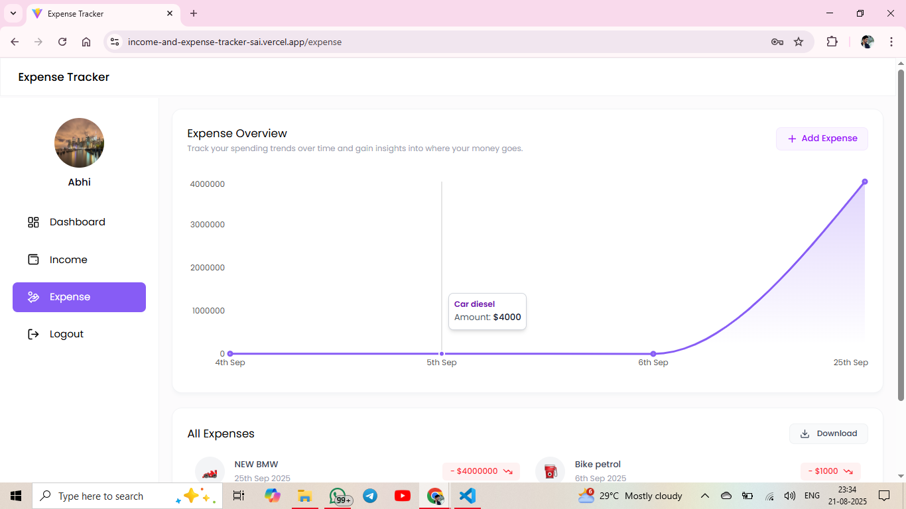
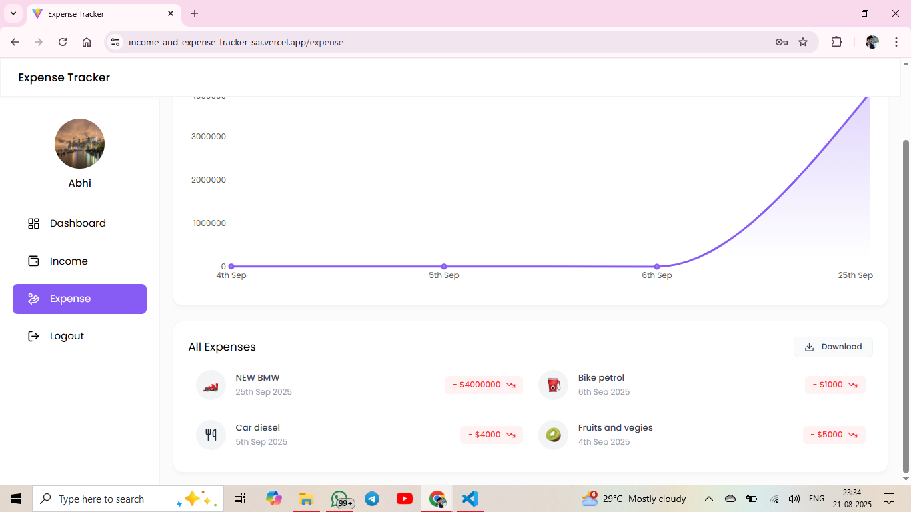

# 💰 Expense Tracker App (MERN)

A **fully responsive Expense Tracker Application** built using the **MERN stack (MongoDB, Express, React, Node.js)**.  
This app allows users to securely manage their income and expenses, visualize financial data with interactive charts, and export reports in Excel format.

---

## ✨ Features

1. 🔐 **User Authentication** – Secure login and sign-up with JWT authentication.
2. 📊 **Dashboard Overview** – Displays **Total Balance, Income, and Expenses** in summary cards.
3. 💵 **Income Management** – Add, view, delete, and export income sources.
4. 🧾 **Expense Management** – Add, view, delete, and export expenses with category-based tracking.
5. 📈 **Interactive Charts** – Visual representation of income & expenses using **Bar, Pie, and Line charts**.
6. 🕒 **Recent Transactions** – Quick access to the latest income and expense records.
7. 📑 **Reports** – Download all income and expense data in **Excel format**.
8. 📱 **Mobile Responsive** – Works seamlessly across desktops, tablets, and mobile devices.
9. 🧭 **Intuitive Navigation** – Sidebar with easy access to **Dashboard, Income, Expenses, and Logout**.
10. ❌ **Delete Functionality** – Hover over income/expense cards to reveal a delete button for easy removal.

---

## 🛠️ Tech Stack

- **Frontend:** React (Vite), Tailwind CSS, Recharts
- **Backend:** Node.js, Express.js
- **Database:** MongoDB (MongoDB Atlas)
- **Authentication:** JWT (JSON Web Token)
- **Deployment:** Vercel (Frontend), Render (Backend)

---

## 🌐 Live Demo

🔗 **Deployed App:** [Expense Tracker Live](https://income-and-expense-tracker-sai.vercel.app/)

---

## 📸 Screenshots

### 🔑 Authentication

### 📊 Dashboard

### 💵 Income Management

### 🧾 Expense Management

